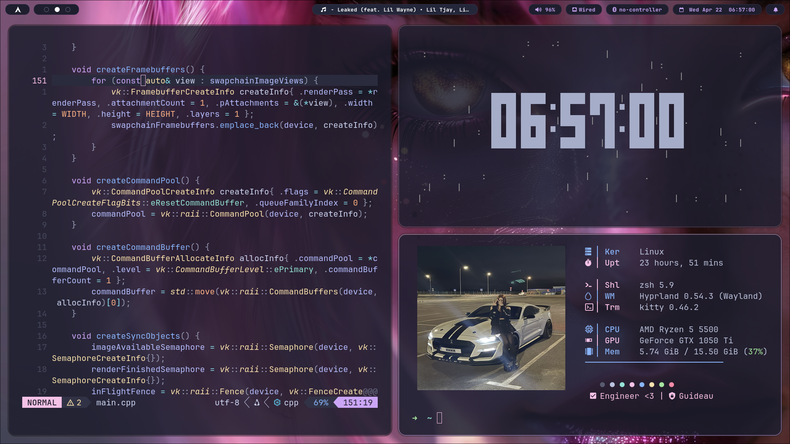

### <p align="center"> Computer Science Student | AI Red Teamer | Security Researcher </p>

<p align="center">
  
</p>

---

## 🛠️ **Current Focus: AI Red Teaming & ML Engineering**

Atualmente cursando **Bacharelado em Ciência da Computação**, unindo a base acadêmica rigorosa à exploração de sistemas de alta complexidade. Minha especialização reside na interseção entre **Segurança Ofensiva** e **Machine Learning Engineering**, com foco na desconstrução de modelos e na análise de vulnerabilidades em sistemas inteligentes.

* 🧠 **Machine Learning Engineering:** Estudo profundo de cálculo multivariável e álgebra linear. Minha especialização foca no desenvolvimento e na segurança de modelos, entendendo a matemática por trás dos pesos para mitigar ataques adversariais.
* 🛡️ **AI Red Teaming:** Em fase de transição para o path **AI Red Team do Hack The Box**. Pesquisando *Adversarial Attacks*, *Prompt Injection* e técnicas de envenenamento de dados (*Data Poisoning*).
* 🔬 **Offensive Systems:** Expertise em Windows Internals e Engenharia Reversa (x64 Assembly). Focado em como modelos de IA integrados ao SO podem ser comprometidos via manipulação de memória e injeção de processos.

---

## ⚡ **2026 Certification & Training Grind**

Progresso técnico em segurança de sistemas e transição para o domínio de Inteligência Artificial:

| ID | Certification / Path | Focus Area | Status |
| :---: | :--- | :--- | :---: |
| **ED** | Evasão de Defesas (Desec) | `EDR/AV Bypass & Post-Exploitation` |  |
| **HTB** | AI Red Team Job Role | `LLM Attacks & Adversarial ML` |  |
| **ML** | Mathematics for ML | `Calculus & Linear Algebra` |  |
| **DCPT** | Desec Certified PenTester | `Network Exploitation` |  |
| **CREB** | Certified Reverse Eng. | `x64 Assembly & Debugging` |  |
| **CPIA** | Process Injection Analyst | `Memory Injection & Evasion` |  |

---

## ⌨️ **Core Stack**

```cpp
struct Researcher {
    const char* degree     = "B.S. in Computer Science";
    const char* focus      = "ML Engineering & Offensive Security";
    const char* languages[]  = {"C++23", "Python (PyTorch)", "Assembly x64"};
    const char* env[]       = {"Arch Linux", "Windows Kernel", "CUDA"};

    // Synergy: Using CS fundamentals to break and secure AI
    void current_state() {
        while (academic_grind && technical_grind) {
            study(MULTIVARIABLE_CALCULUS); // Engineering the math
            analyze(PROCESS_MEMORY);       // CPIA: Where the model lives
            reverse(MODEL_RUNTIME);        // CREB: How the model executes
            evade(EDR_AV_SENSORS);         // ED: Already mastered
            
            if (goal == "AI_RED_TEAMER") break; 
        }
    }
};
