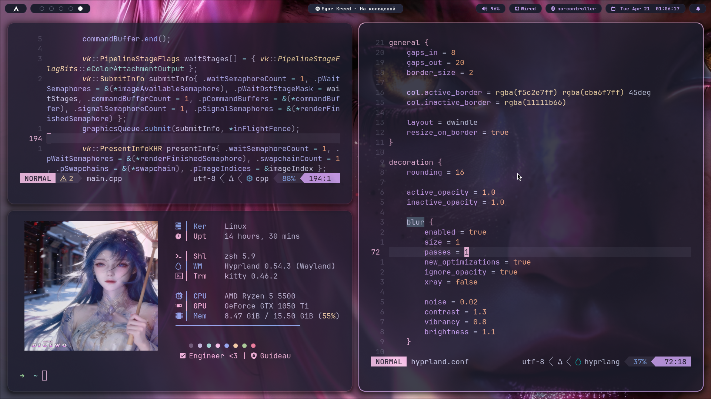

### <p align="center"> IA & Machine Learning Student | Security Researcher </p>

<p align="center">
  
</p>

---

## 🛠️ **Current Focus & Expertise**

Atualmente cursando Bacharelado em Ciência de Dados e mergulhado no estudo de sistemas operacionais e segurança ofensiva. Meu objetivo não é apenas usar ferramentas, mas entender a mecânica por trás da execução de código e manipulação de memória no Windows.

* 🔬 **Reverse Engineering (In Training):** Focado em entender o fluxo de controle em Assembly x64 e desconstruir binários PE.
* ⚔️ **Offensive Development:** Estudando técnicas de evasão e injeção de processos (CPIA) para entender como o software malicioso interage com o subsistema nativo do Windows.
* 💻 **Systems Internals:** Leitura e prática baseada na arquitetura NT (Pavel Yosifovich), focado em processos, threads e gerenciamento de memória.

---

## ⚡ **2026 Certification & Training Grind**

Documentando minha evolução técnica através das seguintes trilhas em progresso:

| ID | Certification / Course | Focus Area | Status |
| :---: | :--- | :--- | :---: |
| **ED** | Evasão de Defesas (Desec) | `EDR/AV Bypass & Post-Exploitation` |  |
| **CREB** | Certified Reverse Engineering Beginners | `x64 Assembly & Debugging` |  |
| **COWA** | Certified Offensive Windows API | `Win32/Native API & Syscalls` |  |
| **CPIA** | Certified Process Injection Analyst | `Memory Injection & Evasion` |  |
| **CMAB** | Certified Malware Analysis Beginners | `Static/Dynamic Analysis` |  |
| **DCPT** | Desec Certified Penetration Tester | `Network Exploitation` |  |

---

## ⌨️ **Core Stack**

```c++
struct Researcher {
    const char* title          = "Bachelor's degree in data science";
    const char* languages[]    = {"C++20", "Assembly x86_64", "Haskell"};
    const char* environment[]  = {"Arch Linux", "Gentoo", "Windows Kernel Labs"};
    
    // Objective: Master the transition from User Mode to Kernel Mode
    void current_state() {
        bool grinding = true;
        while(grinding) {
            study(REVERSE_ENGINEERING);
            analyze(MALWARE_SAMPLES);
            evade(MODERN_DEFENSES);
            if (knowledge >= CRITICAL_MASS) break;
        }
    }
};
